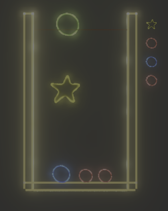
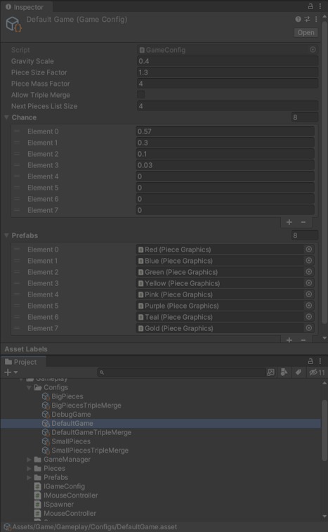
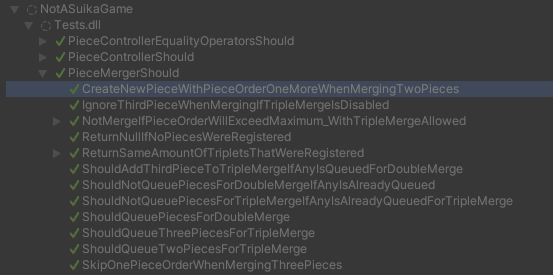

# NotASuikaGame

A simple (not) Suika Game where you have to merge similar pieces together as much as possible to get the highest score.



## Objective
With this project, I wanted to learn and use Unity's URP and ShaderGraph, so I decided to make something with really simple gameplay so I could focus on learning new things.

I wanted to try making a sort of neon effect, with animations all made inside the shader. You can customize animation scale, direction, neon intensity and color by a shader controller script called Glowsticks. Shader is made using proper input packing into a vec4 for a little bit o optimization. I quickly made all sprite textures in paint, so they are all basic shapes, some with a blur, and all kinda messy.

## Code
All code is written with proper Depency Injection, following KISS principles, all behind interfaces and with a few written tests.
Game settings and configurations are all defined in scriptable object so a designer could tweak them without needing to code and to easily create variations and new game modes.
In this game config, a design could add or remove pieces, their physical size scaling, score scaling and basically all game parameters.



## Tests
Tests were written using NSubstitute for mocking and FluentAssertions. Tests try to follow the same directory structure as the code but instead of one test file per script, there is a directory with multiple test files per script. Each test file should test one Behaviour (design level behaviour). This is intended to follow Behaviour Driven Design, a design pattern similar to Test Driven Design but with more emphasis on actual behaviours and logic, instead of only testing for the sake of testing.

Test files use the follow nomenclature: `ClassToTestShould.BehaviourToTest.cs`. Test methods uses the following depending on what they are:

- Setup method: `Given<ScenarioToTest>()`
- Method that is being tested: `When<MethodToTestIsCalled>()`
- Asserts: `Then<ExpectedResult>()`

A test method will always look somewhat like this:
```CSharp
[Test]
public void DoNothingIfAnyCollidingPieceIsAlreadyMerging(){
    // Given methods are setup methods
    GivenPieceIsInPlay();
    var otherPiece = GivenOtherCollidingPiece(id: 2, order: 2, isInPlay: true, isMerging: true);

    // When method is the method under test
    WhenColliding(otherPiece);

    // Then method is the assertions to check for
    ThenMergerShouldNotBeCalled();
}

```

The idea is that tests should be clearly readable in natural language, you shouldn't have to parse what the test is trying to test, you can just read it out loud and understand it, even if someone doesn't know progamming (probably would still need to have knowledge about the project domain). Because of this, test names could become pretty long as well.
I also use one file that has no `.BehaviourToTest` and this is the shared Setup file for all the tests, sometimes with Given methods that could be used as setup in multiple Behaviours




### Given Methods
These methods should setup the test scenario, like configuring mocks, setting up parameter values and such. They can setup an object or return a that will be passed to the test method (When method). Can have as many as needed per test.

```CSharp
IPieceController GivenPiece(int id, int order)
{
    IPieceController pieceMock = Substitute.For<IPieceController>();
    pieceMock.Id.Returns(id);
    pieceMock.Order.Returns(order);
    pieceMock.Position.Returns(UnityEngine.Vector3.zero);
    return pieceMock;
}
```

### When Methods
These typically are 1 liners that simply call the method you intend to test. The main purpose or having these methods is to have a proper natural readable name for the method you want to test. Should have only one of these per test.

```CSharp
Triplet<IPieceController> WhenConsumingFromQueue() => merger.Consume();

```

### Then Methods
These are the methods that do the assertions for the results. You can have multiple Then methods per tests but too many thens could be an indication of a bad test or too much side effects from the method you are testing and the method should probably refactored.
Then methods should only make assertions on one context. For example, if your method is doing something with a list, a Then method could check for list size and expected values in the list, but shouldn't also check if another flag was set somewhere else. This should go to another, different Then method. Having Then methods like this is what indicates how much responsibilities your method currently has.

```CSharp
void ThenNextPiecesShouldHaveSize(List<IPieceController> nextPieces, int expectedSize)
{
    nextPieces.Should().NotBeNull().And.HaveCount(expectedSize);
}
```


